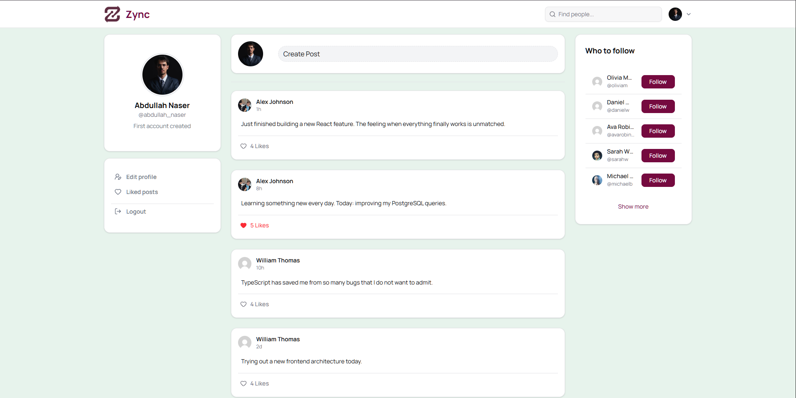
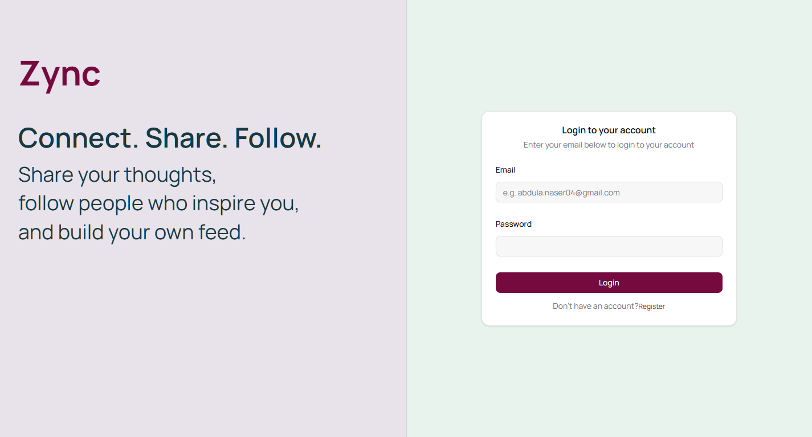
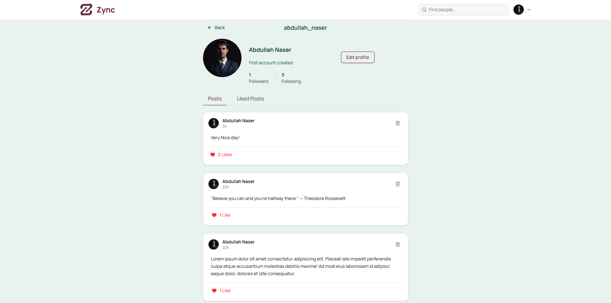
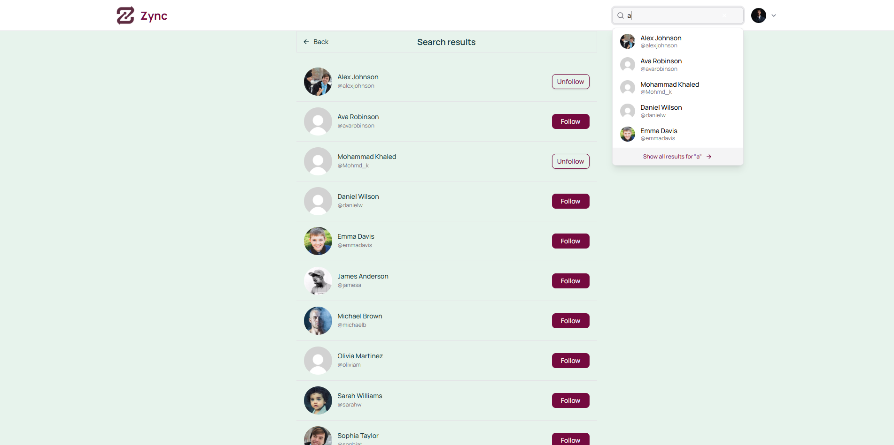
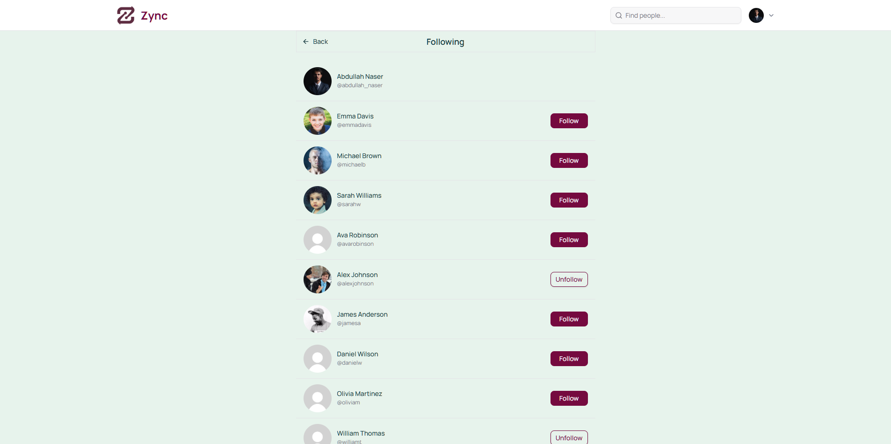
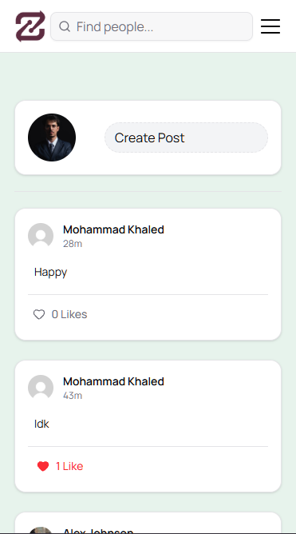

# Zync

A full-stack social media platform — follow people, post updates, like content, and explore profiles.

**Live:** [zync-app.netlify.app](https://zync-app.netlify.app)

---

## Features

### Authentication

Secure authentication using JWT stored in httpOnly cookies, with session hydration via the authenticated user endpoint.

### User Profiles

User profiles with follower counts, posts, and follow/unfollow interactions.

### Search

Debounced user search with responsive results and quick profile access.

### Following

Paginated followers and following lists.

### Responsive UI

Responsive interface built with React, Tailwind CSS, and shadcn/ui across desktop and mobile screens.

---

## Tech Stack

| Layer        | Choice                     | Why                                                      |
| ------------ | -------------------------- | -------------------------------------------------------- |
| Frontend     | React 19 + TanStack Router | File-based routing, type-safe params                     |
| Server state | TanStack Query             | Infinite queries, caching, optimistic updates            |
| Forms        | TanStack Form              | Controlled form state and validation                     |
| Styling      | Tailwind CSS 4 + shadcn/ui | Utility-first styling with accessible primitives         |
| Global state | Nanostores                 | Lightweight client state for authentication              |
| Backend      | Node.js + Express          | Simple REST API                                          |
| Database     | PostgreSQL on Neon         | Relational data with raw SQL                             |
| Auth         | JWT + httpOnly cookies     | Session-based authentication without localStorage tokens |
| Media        | Cloudinary                 | Direct browser-to-cloud uploads                          |
| Deploy       | Railway + Netlify          | Independently deployed frontend and API                  |

---

## Technical Highlights

**No auth library** — implemented JWT authentication, httpOnly cookies, CORS, session middleware, and auth hydration from scratch. On refresh, `GET /auth/me` restores the authenticated user before protected routes render.

**No ORM** — used raw SQL with `pg` to work directly with joins, constraints, and relational data. The feed query combines post data, author information, like counts, and the current user's like state.

**Optimistic updates** — likes and follows update the UI immediately across all relevant TanStack Query caches, with rollback when a mutation fails.

**Reusable architecture** — built shared hooks such as `useInfiniteScroll`, `useInfiniteList`, and `useLikeMutation` to reuse pagination, mutations, and loading behavior across feed, profiles, search, followers, and following views.

**Infinite scrolling** — implemented with `useInfiniteQuery` and `IntersectionObserver`, allowing additional pages to load automatically as the user approaches the end of a list.

**Debounced search** — user search waits for a 300ms debounce before requesting results, reducing unnecessary API calls while typing.

**Direct media uploads** — avatars are uploaded directly from the browser to Cloudinary, keeping file handling out of the API server.

**Decoupled deployment** — the React client and Express API are deployed independently and communicate over HTTP using cookie credentials.

---

## Database Design

Four normalized tables:

`users` · `posts` · `follows` · `likes`

- Composite primary keys prevent duplicate follows and likes
- Foreign keys enforce relational integrity
- `ON DELETE CASCADE` keeps related data consistent
- `TIMESTAMPTZ` provides consistent UTC timestamps

---

## What I Learned

- Implementing JWT authentication and cookie-based sessions at the HTTP level
- Writing raw SQL joins and understanding what ORMs abstract away
- Managing multiple TanStack Query caches during optimistic updates
- Separating server state from client state
- Designing reusable hooks for data-heavy interfaces
- Deploying a decoupled frontend/backend architecture

---

## What I'd Add Next

- Real-time notifications with WebSockets
- Comment system and replies
- Image posts
- Direct messages
